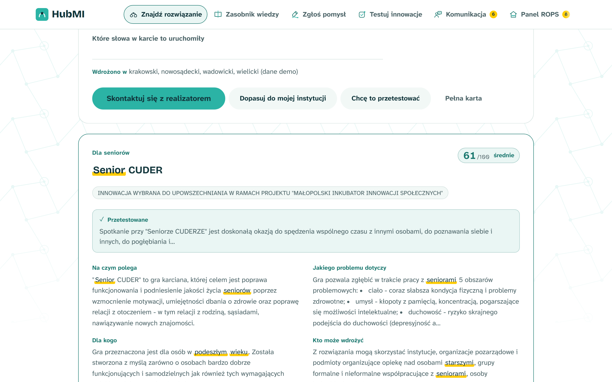
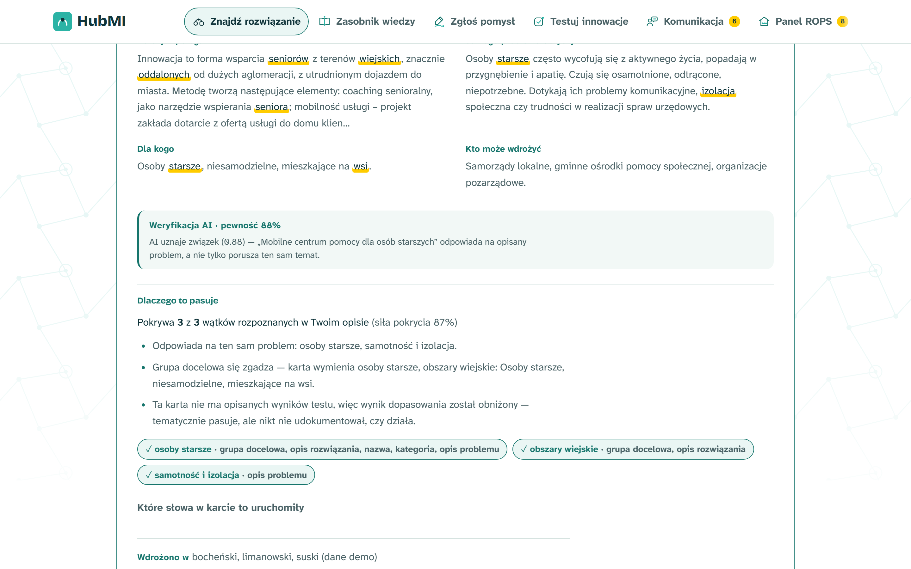
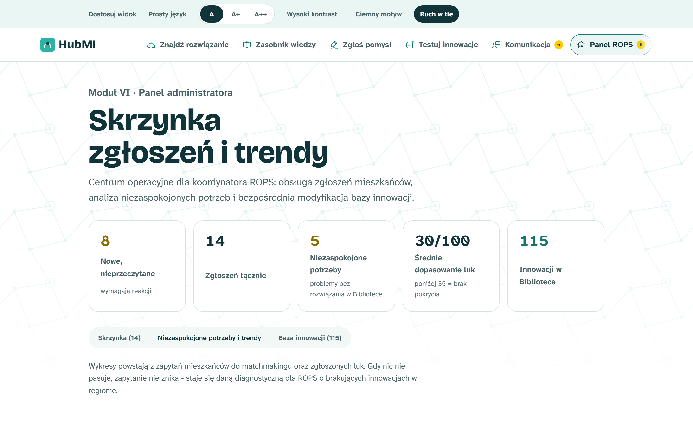
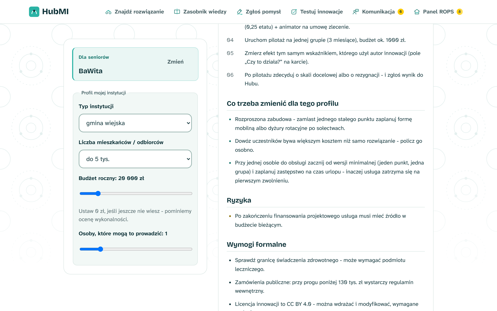
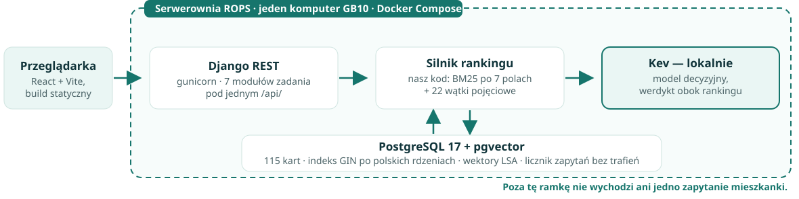

<!-- _class: lead-slide -->
<!-- _paginate: false -->

# HubMI — Małopolski Hub Innowacji Społecznych

<strong>Opisz problem. Pokażemy, co już zadziałało.</strong>

  

7/7

modułów zadania

  

115

innowacji z testem

  

0

naruszeń WCAG (axe)

---

## Problem: wiedza jest, tylko nikt do niej nie trafia

  
  
  

**21:40, kuchnia w gminie pod Nowym Sączem.** Anna szuka pomocy dla mamy, która zaczęła wychodzić z domu i nie pamięta drogi powrotnej. Wpisuje to, co naprawdę czuje: *„boimy się, że wyjdzie z domu i nie wróci”*.

Rejestr odpowiada w swoim języku: *„deinstytucjonalizacja”*, *„izolacja społeczna na obszarach peryferyjnych”*.

**Zero trafień.** Anna zamyka laptopa.

A rozwiązanie **istnieje** — trzy gminy dalej, z opisanym wynikiem testu i realizatorem, który odbiera telefon.

### Ta sama ściana, druga strona biurka

Wójt wchodzi na sesję Rady Gminy z wnioskiem o grant na pomysł, który **sąsiednia gmina wdrożyła dwa lata temu**. Nie wie o tym, bo ta wiedza leży w PDF-ach.

ROPS przez dekadę przetestował **115 innowacji**. W **111 ze 115** kart jest wprost napisane, co zadziałało — i ani jedna nie dociera do Anny.

**Nie brakuje innowacji. Brakuje warstwy, która tłumaczy język człowieka na język instytucji — i odwrotnie.**

---

## Moduł I — matchmaking: rozmowa zamiast formularza

Mieszkanka pisze **zwykłym językiem** albo dyktuje głosem. Asystent dopytuje **najwyżej dwa razy** — nie przesłuchuje.

System rozpoznaje obszary (*osoby starsze, samotność, obszary wiejskie*) i porównuje zgłoszenie z bazą przetestowanych innowacji.

---

## Zaufanie: każde trafienie jest rozliczone

Nie pokazujemy liczby z czarnej skrzynki, tylko **dlaczego**:

- ile wątków pokrywa i **których nie pokrywa**
- w którym polu karty się zgadza
- **jakie słowa** to uruchomiły — podświetlone w tekście
- cytat z pola *„czy to działa”* — realny wynik testu

**Karta bez wyników testu dostaje niższy wynik** i jest to napisane wprost.

---

## Gdy nic nie pasuje — luka staje się policzalnym popytem

Brak dopasowania **nie jest błędem — jest pomiarem**. Każde zapytanie bez trafienia zapisuje się w panelu ROPS z kompletem liczb:

- **ile razy** szukano tego samego rozwiązania, którego nie ma
- **kiedy i jak często** — rozkład w czasie, sezonowość, trend tydzień po tygodniu
- **jakimi słowami** — pojęcia, których Bibliotece brakuje
- **skąd** — w których gminach potrzeba narasta

To jest <strong>zmierzony popyt na rozwiązanie, które jeszcze nie powstało</strong>: ROPS widzi, co ogłosić w kolejnym naborze, a inwestor albo NGO — jak duży jest rynek, zanim ktokolwiek wyda złotówkę na pilotaż.

---

## Dla gminy: innowacja przeliczona na usługę, nie inspiracja

**Middleman** bierze innowację i profil instytucji — typ, liczbę mieszkańców, budżet, obsadę — i zwraca:

- **kroki wdrożenia** z budżetem pilotażu
- **co trzeba zmienić** przy tej skali
- **ryzyka** (np. finansowanie po projekcie)
- **wymogi formalne**: zamówienia publiczne, licencja, granica świadczenia zdrowotnego

To dokument, z którym wójt wchodzi na sesję Rady Gminy.

---

## Jak to dowozimy: model decyzyjny, nie generatywny

### Ranking liczy nasz kod

BM25 po 7 polach karty plus mostek pojęciowy z 22 wątkami. Wynik jest **deterministyczny**: to samo zapytanie zawsze daje ten sam wynik, a „dlaczego” da się pokazać. Model dostaje krótką listę kandydatów i **dopisuje werdykt obok**, a nie zamiast.

### Uruchamialne u ROPS

Odpowiedź w **~300 ms**, bez generowania prozy — nie ma w czym halucynować. Gdy model milczy, **ranking i uzasadnienia zostają te same**. Kev liczy się na **naszym GB10**, więc czas odpowiedzi nie zależy od cudzej kolejki ani limitu zapytań.

### Nikt wam tego nie wyłączy

Liczy się **lokalnie**, więc nie zależymy od cennika ani roadmapy dużej firmy. Modele bywają wycofywane kilka dni po premierze — u nas to nie awaria, bo nie ma czego migrować i nie ma zewnętrznego dostawcy, którego trzeba pilnować.

<strong>Suwerenność danych:</strong> on-premise nie jest tańsze — kupuje się nim kontrolę. Dane mieszkańców Małopolski <em>nie opuszczają Małopolski</em> — Kev liczy się na tym samym komputerze, co baza i API. Żadne zdanie wpisane przez mieszkankę nie trafia do zewnętrznego dostawcy.

---

## Architektura: trzy kontenery na jednym komputerze GB10

### Ranking: deterministyczny

BM25 po 7 polach karty — od *opisu problemu* (waga 3,0) po *wyniki testu* (0,9) — plus mostek 22 wątków. Te same wagi liczy Django i `match.ts`, więc **przeglądarka daje identyczny wynik nawet bez backendu**.

### Kev: pytania, nie prompt

Dostaje kandydatów i **pytania typowane** — tak/nie, wybór z listy, ocena po rubryce — i oddaje odpowiedzi z prawdopodobieństwem w jednej passie. Żadnego generowania tekstu, żadnego klucza do cudzego API.

### Awaria modelu ≠ awaria usługi

Klient AI zwraca `None` zamiast wyjątku. Gdy Kev nie odpowie, endpoint **oddaje ten sam ranking i te same uzasadnienia** — znika tylko werdykt obok. Polski stemmer i indeks GIN też są nasze, bez zewnętrznych zależności.

---

## Wartość — cztery grupy odbiorców z zadania

| Odbiorca | Co dostaje | Czego dziś nie ma |
|---|---|---|
| **Mieszkańcy i NGO** | opis własnymi słowami lub głosem → rozwiązania **z udokumentowanym testem** i instytucja do kontaktu | pusta lista i wymóg znajomości urzędowego słownika |
| **JST — wójt, OPS, CUS** | wdrożenie policzone na **ich** skali: koszt, obsada, ryzyka, wymogi formalne | inspiracja w PDF-ie, z której nie zrobi się uchwały |
| **Pracownicy ROPS** | skrzynka zgłoszeń, odpowiedzi i **żywe zestawienie niezaspokojonych potrzeb** | diagnoza regionu zamawiana jako osobne badanie |
| **Eksperci branżowi** | wątki z autorami pomysłów, ocena testerska 1–5 z wymaganym komentarzem | brak kanału między doradcą a innowatorem |

Dostępność nie jest dopiskiem: baza <strong>18 px</strong> (nie 16 — odbiorcą są seniorzy) z przełącznikiem do 27 px, prosty język, kontrast do <strong>21:1</strong>, mapa z odpowiednikiem tabelarycznym, pełna obsługa klawiaturą.

---

## Koszty: mniej niż jeden grant — i rachunek, który nie rośnie

  

30 tys. zł

wdrożenie jednorazowo

<strong>Ćwierć</strong> jednego grantu z naboru IWS 2.0

  

~63 tys. zł

utrzymanie rocznie

Ćwierć etatu koordynatora + utrzymanie techniczne

  

~950 zł

sama infrastruktura / rok

Prąd i backup — bez licencji i bez chmury

### Rachunek przewidywalny, nie zmienny

Kev stoi na GB10, więc **nie ma rachunku za tokeny ani limitu zapytań** — koszt zmienny to prąd. 50 tys. zapytań rocznie kosztuje tyle samo, co 5 tys. Budżet na kolejny rok da się zaplanować dziś i **nie zmieni go niczyja decyzja cenowa**.

### Zwrot po jednym uniknięciu

Wystarczy, że w ciągu roku **nie** powtórzymy *jednego* już sfinansowanego pomysłu albo *jedna* gmina wdroży gotowe rozwiązanie zamiast projektować je od zera. Przy **182 gminach** to minimum, nie optymizm.

Wracając do Anny: ona nie potrzebuje kolejnego naboru ani kolejnego raportu. Potrzebuje jednego zdania — <em>„to już zadziałało trzy gminy dalej, zadzwoń tutaj”</em>. Tyle kosztuje to jedno zdanie — i stoi na komputerze w serwerowni ROPS, a nie na czyimś API.

